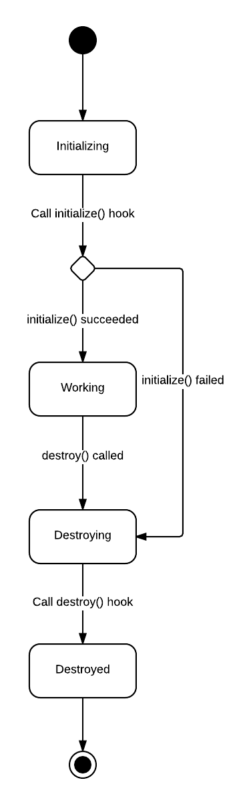

# Comedy

[](https://app.buddy.works/comedy/comedy/pipelines/pipeline/295827)
[](https://ci.appveyor.com/project/weekens/comedy)
[](https://codecov.io/gh/untu/comedy)


Comedy is a Node.js actor framework.

Actors are all about flexible scalability. After describing your application
in terms of actors, you can scale arbitrary parts of the application to multiple cores on a
single host (by spawning sub-processes) or even to multiple hosts in your network by simply
 modifying the configuration and without changing a single line of code.

<!-- toc -->

- [Installation](#installation)
- [Quick Start](#quick-start)
  * [Class-Defined Actors](#class-defined-actors)
  * [Module-Defined Actors](#module-defined-actors)
      - [Important note about code transfer](#important-note-about-code-transfer)
- [Scaling](#scaling)
  * [Programmatic configuration](#programmatic-configuration)
  * [Using configuration file](#using-configuration-file)
  * [Hot configuration change](#hot-configuration-change)
  * [Scaling to multiple instances](#scaling-to-multiple-instances)
  * [Remote Actors](#remote-actors)
    + [Named clusters](#named-clusters)
    + [Multiple hosts](#multiple-hosts)
  * [Threaded Actors](#threaded-actors)
  * [Actor Respawning (Supervision)](#actor-respawning-supervision)
- [Actor Lifecycle](#actor-lifecycle)
  * [initialize() lifecycle hook](#initialize-lifecycle-hook)
  * [destroy() lifecycle hook](#destroy-lifecycle-hook)
- [Logging](#logging)
  * [Setting the log level](#setting-the-log-level)
    + [Dynamic logger configuration](#dynamic-logger-configuration)
- [Resource Management](#resource-management)
- [Actor Metrics](#actor-metrics)
- [Advanced Features](#advanced-features)
  * [Dropping messages on overload](#dropping-messages-on-overload)
  * [Custom balancers](#custom-balancers)
  * [System bus](#system-bus)
- [Upcoming Features](#upcoming-features)
  * [Optimized message serialization](#optimized-message-serialization)
  * [Hot code deployment](#hot-code-deployment)
  * [Automatic actor clustering according to load](#automatic-actor-clustering-according-to-load)
- [Breaking Changes in v 2.0](#breaking-changes-in-v-20)
  * [No external actor child creation](#no-external-actor-child-creation)
- [About](#about)

<!-- tocstop -->

> **Note:** Breaking changes in version 2.0 are covered [here](#programmatic-configuration-1).

## Installation

Comedy is installed with NPM by running:

    npm install comedy

After that you can use Comedy framework in your code by requiring `comedy` package.

```javascript
var actors = require('comedy');
```
    
## Quick Start

Running your first actor is as simple as follows:

```javascript
var actors = require('comedy');

var actorSystem = actors(); // Create an actor system.

var myActorPromise = actorSystem
  .rootActor() // Get a root actor reference.
  .then(rootActor => {
    return rootActor.createChild({ // Create a child actor that says hello.
      sayHello: to => {
        console.log(`Hello, ${to}!`)
      }
    });
  });

myActorPromise.then(myActor => {
  // Our actor is ready, we can send messages to it.
  myActor.send('sayHello', 'world');
});
```
    
This will print

    Hello, world!
    
along with some other log messages from a created actor system.

So, the steps required to create and run a minimal actor are the following:

1. *Create an actor system.* You would normally do that in your main (startup) script. There is
a bunch of options that you can pass when creating an actor system, and these options will
be discussed in later sections. For now, we'll be just using the defaults.
2. *Get a reference to a Root actor.* Actors can only be created by other actors, so you need
an initial actor to start from. This actor is called a Root actor, and you can get it from
actor system by using `rootActor()` method. The method returns not the actor itself, but
a Promise of the Root actor. To get an actual reference, we use `Promise.then()` method.
(Comedy uses [Bluebird](http://bluebirdjs.com/) promise library. For more information 
about promise API, please refer to
[Bluebird documentation](http://bluebirdjs.com/docs/api-reference.html)).
3. *Create your actor as a child of a Root actor by using `createChild()` method.*
This method takes an actor definition as a first argument. An actor definition describes
a behaviour of an actor: it defines what messages an actor can accept and how does it respond
(message handlers) as well as how an actor is initialized and destroyed (lifecycle hooks).
Actor definition can be represented in several formats. In our example, we're using a plain object
actor definition with a single message handler, that handles `sayHello` message. It awaits a 
single `to` argument, prints a message to console and does not respond anything.

### Class-Defined Actors

In previous section we've used plain-object actor definition to create our hello world actor.
Another way to define actor behaviour is to use a class:

```javascript
var actors = require('comedy');

/**
 * Actor definition class.
 */
class MyActor {
  sayHello(to) {
    console.log(`Hello, ${to}!`);
  }
}

actors()
  .rootActor() // Get a root actor reference.
  .then(rootActor => rootActor.createChild(MyActor)) // Create a class-defined child actor.
  .then(myActor => {
    // Our actor is ready, we can send messages to it.
    myActor.send('sayHello', 'world');
  });
```

This example does exactly the same as previous one. The difference is that we have defined our
actor behaviour using a JavaScript class. In this definition, each class method becomes a 
message handler. An instance of `MyActor` class is created together with an actor instance
during actor creation.

The class definition option may be better for several reasons:

- When using classes for defining actor behaviour, you take full advantage of the object-oriented
programming and useful class properties such as inheritance and data encapsulation.
- Your existing application is likely to be already described in terms of classes and their relations.
Given that, it's easy to use any of your existing classes as an actor definition without probably
modifying anything inside this class.

### Module-Defined Actors

If your class is defined in a separate file, making a module (which is most likely the case), you
can simply a specify a path to this module in `createChild()` method.

Let's say, our `MyActor` class from previous example is defined in a separate module called
`MyActor.js` that resides in `actors` folder:

*actors/MyActor.js:*

```javascript
/**
 * Actor definition class.
 */
class MyActor {
  sayHello(to) {
    console.log(`Hello, ${to}!`);
  }
}

module.exports = MyActor;
```

Then we can reference it in `createChild()` method by simply specifying a module path:

```javascript
var actors = require('comedy');

actors()
  .rootActor() // Get a root actor reference.
  .then(rootActor => rootActor.createChild('/actors/MyActor')) // Create a module-defined child actor.
  .then(myActor => {
    // Our actor is ready, we can send messages to it.
    myActor.send('sayHello', 'world');
  });
```

This example would again print "Hello world!".

When we put a slash at the start of our module path, the module is looked-up relative
to the project root (a folder where the `package.json` file is).

##### Important note about code transfer

Though module-defined actor may seem like a mere shortcut for specifying a direct class
reference, it has a subtle difference in case of creating forked or remote actors (separate-process
actors, see below), that you should be aware of. That is: when you create a forked/remote
(separate-process) actor with class-defined behaviour, Comedy serializes the code of your
class definition and passes it to a child actor process, where it is being compiled. This
means that you cannot reference external variables (such as module imports) from your class,
because these external variables won't be recognized by a child process and actor definition
compilation will fail (you can import modules inside your class definition, however, and that
will work).

When using module-defined actors, you have no such problem, because in this case Comedy
simply passes a module path to a child process, where it is then imported using a regular
Node.js module resolution process.

Given the above, module path is a preferred way of specifying actor definition to `createChild()`
method. Class and plain-object definitions may still be a good option when a definition is
simple and self-contained and you don't want to bother creating a separate file for it.

## Scaling

The whole point of actors is the ability to scale on demand. You can turn any actor to a standalone
process and let it utilize additional CPU core on either local or remote machine. This is done by
just using a configuration property, which can be specified both programmaticaly and using a
configuration file. Let's see the programmatic example first.

### Programmatic configuration

The following example runs `MyActor` actor as a separate operating system process.

```javascript
var actors = require('comedy');

/**
 * Actor definition class.
 */
class MyActor {
  sayHello(to) {
    // Reply with a message, containing self PID.
    return `Hello to ${to} from ${process.pid}!`;
  }
}

// Create an actor system.
var actorSystem = actors();

actorSystem
  // Get a root actor reference.
  .rootActor()
  // Create a class-defined child actor, that is run in a separate process (forked mode).
  .then(rootActor => rootActor.createChild(MyActor, { mode: 'forked' }))
  // Send a message to our forked actor with a self process PID.
  .then(myActor => myActor.sendAndReceive('sayHello', process.pid))
  .then(reply => {
    // Output result.
    console.log(`Actor replied: ${reply}`);
  })
  // Destroy the system, killing all actor processes.
  .finally(() => actorSystem.destroy());
```

In the example above we define `MyActor` with a `sayHello` message handler, which replies
with a string containing the self process PID. Then, like in previous examples, we create
an actor system, get a root actor, and create a child actor with `MyActor` definition.
But here we specify an additional option: `{ mode: 'forked' }`, that tells the actor system
that this actor should be run in a separate process ("forked" mode). Then, once child
actor is created, we send a message with `sayHello` topic and wait for response using
`sendAndReceive` method. For a message body we, again, use self process PID. Once the
response from child actor is received, we print it to console and destroy the actor
system.

The output for this example should contain a string like:

    Actor replied: Hello to 15327 from 15338!
    
As you see, the self PID that we send and the self PID that `MyActor` replies with
are different, which means that they are run in separate processes. The process where
`MyActor` is run will be a child of a process, where an actor system is created, and
the messaging between actors turns from method invocation to an inter-process communication.

If you switch to in-memory mode by changing `mode` option value from "forked" to "in-memory"
(which is a default and is equivalent to just omitting the options in `createChild` method),
then both root actor and `MyActor` actor will be run in the same process, the messaging
between actors will boil down to method invocation and the PIDs in the resulting message
will be the same.
 
```javascript
actorSystem
 .rootActor()
 // ...
 .then(rootActor => rootActor.createChild(MyActor, { mode: 'in-memory' }))
 // ...
 .finally(() => actorSystem.destroy());
```
 
    Actor replied: Hello to 19585 from 19585!
 
### Using configuration file

An alternative for using programmatic actor configuration is a configuration file.
It is a JSON file with an actor name to options mapping, like the one below:

```json
{
  "MyActor": {
    "mode": "in-memory"
  },
  "MyAnotherActor": {
    "mode": "forked"
  }
}
```

The above file states that actor with name `MyActor` should be run in in-memory mode, while
actor named `MyAnotherActor` should be run in forked mode. If you name this file `actors.json`
and place it at the root of your project (a directory where your `package.json` file is),
Comedy will automatically pick this file and use the actor configuration from there.

You can also put your actor configuration file wherever you want and give it arbitrary name,
but in this case you should explicitly specify a path to your actor configuration file
when creating the actor system:

```javascript
var actorSystem = actors({
  config: '/path/to/your/actor-configuration.json'
});
```

You can use both the default `actors.json` configuration file and your custom configuration
file, in which case the configuration from the default `actors.json` file is extended with
the custom configuration (what is missing in custom configuration is looked up in default).

Please note that for a given actor programmatic configuration takes precedence over file
configuration: only those configuration properties that are missing in programmatic
configuration are taken from file configuration. So, for example, if you have programmaticaly
specified that the actor should run in in-memory mode, there is no way to override it
using the file configuration.

### Hot configuration change

Starting from Comedy 2.0, no application restart is needed when you modify actor configuration file.
Comedy automatically detects changes and dynamically rebuilds actor hierarchy where needed.

### Scaling to multiple instances

Besides forking just one single instance of your actor to a separate process, you can spawn
multiple instances of your actor to multiple separate processes by simply using a 
configuration property. This configuration property is named `clusterSize`. Here is an example:

```javascript
var actors = require('comedy');
var P = require('bluebird');

/**
 * Actor definition class.
 */
class MyActor {
  sayHello(to) {
    // Reply with a message, containing self PID.
    return `Hello to ${to} from ${process.pid}!`;
  }
}

// Create an actor system.
var actorSystem = actors();

actorSystem
  // Get a root actor reference.
  .rootActor()
  // Create a class-defined child actor.
  .then(rootActor => rootActor.createChild(MyActor, {
    mode: 'forked', // Spawn separate process.
    clusterSize: 3 // Spawn 3 instances of this actor to load-balance over.
  }))
  .then(myActor => {
    // Sequentially send 6 messages to our newly-created actor cluster.
    // The messages will be load-balanced between 3 forked actors using
    // the default balancing strategy (round-robin).
    return P.each([1, 2, 3, 4, 5, 6], number => {
      return myActor.sendAndReceive('sayHello', `${process.pid}-${number}`)
        .then(reply => {
          console.log(`Actor replied: ${reply}`);
        });
    });
  })
  .finally(() => actorSystem.destroy());
```

The output for this example will look something like this:

    Actor replied: Hello to 15400-1 from 15410!
    Actor replied: Hello to 15400-2 from 15416!
    Actor replied: Hello to 15400-3 from 15422!
    Actor replied: Hello to 15400-4 from 15410!
    Actor replied: Hello to 15400-5 from 15416!
    Actor replied: Hello to 15400-6 from 15422!
    
As you see, the root actor messages are being round-robin-balanced between 3 child instances of `MyActor` actor.

The `clusterSize` configuration property can be as well used in JSON configuration:

```json
{
  "MyActor": {
    "mode": "forked",
    "clusterSize": 3
  }
}
```

While round-robin balancer is a default, you can also use random balancer by specifying `"balancer": "random"` in
actor configuration:

```json
{
  "MyActor": {
    "mode": "forked",
    "clusterSize": 3,
    "balancer": "random"
  }
}
```

### Remote Actors

In the examples above we used "forked" mode to spawn child processes and utilize additional CPU cores on local
machine. But Comedy won't be a full-fledged actor framework without remoting capability. Using "remote" mode,
you can launch an actor in a separate process on the host of your choice.

Let's take our example with "forked" mode and just change the mode to "remote":

```javascript
var actors = require('comedy');

/**
 * Actor definition class.
 */
class MyActor {
  sayHello(to) {
    // Reply with a message, containing self PID.
    return `Hello to ${to} from ${process.pid}!`;
  }
}

// Create an actor system.
var actorSystem = actors();

actorSystem
  // Get a root actor reference.
  .rootActor()
  // Create a class-defined child actor, that is run on a remote machine (remote mode).
  .then(rootActor => rootActor.createChild(MyActor, { mode: 'remote', host: '192.168.33.20' }))
  // Send a message to our remote actor with a self process PID.
  .then(myActor => myActor.sendAndReceive('sayHello', process.pid))
  .then(reply => {
    // Output result.
    console.log(`Actor replied: ${reply}`);
  })
  // Log errors.
  .catch(err => {
    console.error(err);
  })
  // Destroy the system, killing all actor processes.
  .finally(() => actorSystem.destroy());
```

We have only done one tiny modification: changed child actor mode from "forked" to "remote" and specified
a `host` parameter, that is mandatory for remote mode. The remote mode and host parameters can also be specified
using `actors.json` configuration file.

Now let's run our new example. What we get is:

```
Sun Jun 11 2017 22:00:43 GMT+0300 (MSK) - info: Didn't find (or couldn't load) default configuration file /home/weekens/workspace/comedy/actors.json.
Sun Jun 11 2017 22:00:43 GMT+0300 (MSK) - info: Resulting actor configuration: {}
{ Error: connect EHOSTUNREACH 192.168.33.20:6161
    at Object.exports._errnoException (util.js:1018:11)
    at exports._exceptionWithHostPort (util.js:1041:20)
    at TCPConnectWrap.afterConnect [as oncomplete] (net.js:1086:14)
  code: 'EHOSTUNREACH',
  errno: 'EHOSTUNREACH',
  syscall: 'connect',
  address: '192.168.33.20',
  port: 6161 }
```

The error was thrown, because we need one more thing to be able to launch remote actor on 192.168.33.20: we need
to launch a special Comedy listening node on this machine. To do this, we run the following commands on the target
machine:

```
$ npm install comedy
$ node_modules/.bin/comedy-node
Mon Jun 12 2017 16:56:07 GMT+0300 (MSK) - info: Listening on :::6161
```

The last message tells us that the listener node is successfully launched and listening on default Comedy port `6161`.

After running example again we get:

```
Mon Jun 12 2017 16:56:14 GMT+0300 (MSK) - info: Didn't find (or couldn't load) default configuration file /home/weekens/workspace/comedy/actors.json.
Mon Jun 12 2017 16:56:14 GMT+0300 (MSK) - info: Resulting actor configuration: {}
Actor replied: Hello to 8378 from 8391!
```

This means our remote actor successfully replied to our local actor from remote machine.

#### Named clusters

Most of the time you may probably want to launch a remote actor not on a single machine, but on a cluster of
several machines, one actor per host or more. Comedy allows you to configure a named cluster, which can
be later referenced by `"cluster"` actor option instead of `"host"` option.

```javascript
var actors = require('comedy');
var P = require('bluebird');

/**
 * Actor definition class.
 */
class MyActor {
  sayHello(to) {
    // Reply with a message, containing self PID.
    return `Hello to ${to} from ${process.pid}!`;
  }
}

// Create an actor system.
var actorSystem = actors({
  clusters: {
    // Configure "alpha" cluster, consisting of 3 hosts (each should have comedy-node started).
    alpha: ['192.168.33.10', '192.168.33.20', '192.168.33.30']
  }
});

actorSystem
  // Get a root actor reference.
  .rootActor()
  // Create a class-defined child actor on each host of "alpha" cluster.
  .then(rootActor => rootActor.createChild(MyActor, { mode: 'remote', cluster: 'alpha' }))
  // Send a message to each remote actor in a cluster (messages are round-robin balanced).
  .then(myActor => P.map([1, 2, 3], () => myActor.sendAndReceive('sayHello', process.pid)
    .then(reply => {
      // Output result. There should be replies from each actor in a cluster.
      console.log(`Actor replied: ${reply}`);
    })))
  // Log errors.
  .catch(err => {
    console.error(err);
  })
  // Destroy the system, killing all actor processes.
  .finally(() => actorSystem.destroy());
```

By default, Comedy creates 1 actor per host in a cluster. You can override this by specifying `"clusterSize"`
actor parameter. Comedy will try to distribute the `"clusterSize"` amount of actor instances equally between
the hosts in a cluster, but `"clusterSize"` is not divisible by the number of hosts, some hosts will have 1 actor
less than others.

#### Multiple hosts

Specifying a cluster for remote actor requires prior actor system configuration (see section above). In case
you need to just quickly launch an actor on multiple hosts, you may not bother configuring a cluster and
simply specify a host array in `"host"` actor parameter.

```javascript
rootActor.createChild(MyActor, { mode: 'remote', host: ['192.168.33.10', '192.168.33.20', '192.168.33.30'] })
```

This works the same way as `"cluster"` parameter. The only difference is that now the cluster is unnamed.

### Threaded Actors

In NodeJS v10 *worker threads* were introduced. *Worker threads* are additional threads within the same NodeJS process,
and they allow scaling the load between multiple CPU cores without forking sub-processes. This makes scaling more
lightweight and fast, because *worker thread* is faster to spawn and consumes less resources than a separate OS
process.

Despite the fact that NodeJS *worker threads* run within the same process boundary, they are completely isolated from
each other and can only interact by means of messaging. This fits quite nicely into actor paradigm.

Comedy actors support a `"threaded"` mode. In this mode an actor is launched in a separate worker thread.

In the example above, to run `MyActor` as a worker thread, you simply specify the following configuration:

```json
{
  "MyActor": {
    "mode": "threaded"
  }
}
```

And if you want to distribute the load between multiple worker threads (say, 3), you just add a `"clusterSize"` option,
as usual:

```json
{
  "MyActor": {
    "mode": "threaded",
    "clusterSize": 3
  }
}
```

> In NodeJS v10 worker threads are an experimental feature, so they are not enabled by default. To enable them,
> you need to run your NodeJS executable with `--experimental-worker` option.

### Actor Respawning (Supervision)

When an actor operates in `"in-memory"` mode, only one of two things may happen: either the actor is working or
the whole process has failed. But when an actor is in `"forked"` or `"remote"` mode, it operates in a separate
process and communicates with it's parent across the process boundary. In this case, a child process can fail while
a parent process is alive, and thus the child actor may stop responding to messages from parent actor.

Comedy has a built-in capability of respawning a crashed child process and restoring the child actor. It creates
a new process and a new actor, so, the in-memory state that was kept in a child actor at that point would be lost.
But in all other respects the new child actor will be identical to the lost one, except for actor ID, which will
be new for respawned actor.

To enable automatic child actor respawn, you just need to specify `"onCrash": "respawn"` actor parameter:

```json
{
  "MyForkedActor": {
    "mode": "forked",
    "onCrash": "respawn"
  }
}
```

The configuration above enables automatic actor respawn for all actors with name `"MyForkedActor"`.

There is some additional overhead that you get for enabling this option. Namely, when automatic respawning is enabled,
the child actor with `"onCrash": "respawn"` configured and it's parent actor will exchange keep-alive ("ping-pong")
messages every 5 seconds. If a child actor does not respond to ping within 5 seconds, it is considered dead and a
new child process with new child actor is launched to replace the lost one.

## Actor Lifecycle

Like plain objects, actors live and die. The difference is that an actor instance can be created in a separate
process or even on a separate machine, which is why actor creation and destruction is asynchronous.

An actor lifecycle is represented by the diagram below:



As you can see from this diagram, an actor passes several states along it's life. These are:

- Initializing
- Working
- Destroying
- Destroyed

Some of the above state transitions can be handled by *lifecycle hooks* - special methods in actor
definition, which are all optional.

These lifecycle hooks are covered in the following sections.

### initialize() lifecycle hook

After an actor instance is created, an actor immediately enters Initializing state. At this point, Comedy
first ensures an actor definition instance is created, and then attempts to call an `initialize()` method
of an actor definition instance.

If an `initialize()` method is absent, an actor immediately enters Working state and is ready to handle
incoming messages.

If an `initialize()` method is present in actor definition, Comedy calls this method passing a self
actor instance reference as an input parameter, and looks at return value. If a return value is a `Promise`,
an actor initialization is considered asynchronous and an actor enters Working state only when
a returned promise is resolved. In other cases actor enters Working state immediately after `initialize()`
returns.

If `initialize()` throws exception or a promise returned from `initialize()` is rejected, the actor initialization
is considered failed, and an actor enters Destroying state, which basically starts actor destruction process
(this will be covered later).

With `initialize()` lifecycle hook you can initialize all the things needed for you actor to work. Very often
you will create child actors exactly in `initialize()`:

```javascript
class MyActor {
  initialize(selfActor) {
    // Create child actor.
    return selfActor.createChild(MyChildActor)
      .then(childActor => {
        // Save created child actor to instance field.
        this.childActor = childActor;
      });
  }
}
```

In the example above, `MyActor` will only start handling incoming messages once it's child actor is created
and fully initialized.

### destroy() lifecycle hook

There are several events that can remove actor from existence:

- a destroy() method has been explicitly called on actor (this can be done by actor itself);
- a parent actor is being destroyed;
- an actor process is killed;
- an actor initialization failed (covered above).

In normal cases an actor is destroyed gracefully, which means that it has a chance to do all necessary clean-up
actions before final termination. These actions include destroying all immediate children and calling a `destroy()`
lifecycle hook on actor definition instance.

`destroy()` lifecycle hook is similar to `initialize()` - it is passed in a self actor reference and is allowed
to return promise, in which case a destruction is considered asynchronous and is only finished once a returned
promise is resolved.

The algorithm of actor destruction is the following:

1. Enter Destroying state. At this point actor no longer accepts incoming messages.
2. Destroy immediate actor children. All errors generated by child destruction process are logged and ignored.
 Children are destroyed simultaneously.
3. Call `destroy()` lifecycle hook on self actor definition instance.
4. Once `destroy()` finishes, enter Destroyed state, notify parent and remove actor from memory.

## Logging

Your actor system can quickly become complex enough to require logging facility to trace messages between
actors as well as individual actor workflow.

Comedy comes with a built-in logging facility that lets you write log messages with various severity levels
and distinguish log messages from different actors in a single log output.

A logging is done with a `Logger` instance, that can be retrieved for an actor system or for a particular
actor using `getLog()` method.

```javascript
var actors = require('comedy');

// Create an actor system.
var actorSystem = actors();

/**
 * Example actor definition.
 */
class MyActor {
  initialize(selfActor) {
    // Output actor-level log message.
    selfActor.getLog().info('MyActor initialized.');
  }
}

actorSystem
  .rootActor()
  .then(rootActor => {
    // Output system-level log message.
    actorSystem.getLog().info('Actor system initialized. Creating MyActor actor...');

    return rootActor.createChild(MyActor);
  });
```

This example will output something like:

```
Mon Jan 09 2017 17:44:16 GMT+0300 (MSK) - info: Actor system initialized. Creating MyActor actor...
Mon Jan 09 2017 17:44:16 GMT+0300 (MSK) - info: InMemoryActor(5873a1c0705ebd2a663c3eeb, MyActor): MyActor initialized.
```

The first, system-level message, is prefixed with a current date-time and a log level label.
The second, actor-level message, additionally prefixed with a description of an actor that writes the message. This
prefixing is done automatically.

An actor description has the form:

    ActorInstanceClassName(actorId, actorName)

It is exactly what you get when calling and `Actor.toString()` method.

An actor instance class name reveals the underlying actor instance implementation, which depends on an actor mode,
and can be one of `InMemoryActor`, `ForkedActorParent` or `ForkedActorChild`. An actor ID is generated automatically
for a given actor instance and is unique across the system.

### Setting the log level

In some cases you might not want Comedy to do logging at all. In others you may want extended debug-level logging.
Also, you might want to enable verbose logging for a certain actor while keeping the level for the rest of actors.

The log level is configured using `setLevel()` method of `Logger` instance.

There are 5 log levels in Comedy logger (each one includes all previous):

1. Silent. No log messages are written.
2. Error. Error messages are written.
3. Warn. Warning messages are written.
4. Info. Information messages are written. These messages are typically interesting for system administrators.
5. Debug. Debug messages are written. These are messages that are only interesting for application developers
and include some information about Comedy internals.

Here is an example of how you would configure logging level for the whole actor system:

```javascript
// Create an actor system.
var actorSystem = actors();

// Set Silent logging level - no messages from Comedy will be written.
actorSystem.getLog().setLevel(1);
```

You can also use log level constants:

```javascript
// Create an actor system.
var actorSystem = actors();

// Get system-level logger.
var logger = actorSystem.getLog();

// Set Debug log level.
logger.setLevel(logger.levels().Debug);
```

In a similar way, you can configure log level for a particular actor:

```javascript
class MyActor {
  initialize(selfActor) {
    var logger = selfActor.getLog();
    logger.setLevel(logger.levels().Debug);
  }

  // ...
}
```

#### Dynamic logger configuration

Programmatic logger configuration described above is usually not what you really want. Instead of hard-coding log
levels for various actors, you would normally prefer configuring these log levels in a configuration file to be
able to change them in runtime. Comedy allows you doing this with dynamic logger configuration capability.

To configure log levels dynamically, you need to:

1. Create a file with logger configuration (usually named `logger.json`) in the directory of your choice.
2. Specify a path to this file in `loggerConfiguration` parameter in actor system options.

The `logger.json` file has the following format:

```json
{
  "categories": {
    "Default": "Info",
    "MyActor": "Error",
    "MyOtherActor": "Debug"
  }
}
```

Here we have a category mapping under `categories` key. This mapping object maps logging category name to a log level.
Each category name is just an actor name. So, with the above category mapping you can configure log levels on
per-actor basis. There is a special category name - `"Default"` - which configures the default log level.

In the exampe above: actor(s) with name `"MyActor"` will log messages with `Error` log level or higher; actor(s) with
name `"MyOtherActor"` will log messages with `Debug` log level or higher; all other actors will log messages with
`Info` level or higher.

To enable file-based logger configuration, you need to specify a path to your `logger.json` file (or whatever
the name is) in actor system configuration:

```javascript
var actors = require('comedy');

//...

actors({
  loggerConfiguration: 'conf/logger.json' // You can also specify the absolute path.
})
```

Comedy supports hot logging configuration change. This means that all changes you make to `logger.json` file are
applied on-the-run without process restart.

You can also specify multiple configuration files in actor system configuration. In this case these configurations
will be merged just like `actors.json` files do:

```javascript
var actors = require('comedy');

//...

actors({
  // Files are specified in descending priority: first file has highest priority.
  loggerConfiguration: ['/etc/my-service/logger.json', 'conf/logger.json']
})
```

## Resource Management

Actors are not always completely self-contained. It's not unusual for an actor to require some external re-usable
resource to operate. A typical example of such resource is a connection to a database. Database connection (or 
connection pool) is a kind of a resource that you might want to be re-used by multiple actors within the same process,
but also want it to be re-created for each forked process, spawned by a forked actor. Comedy lets you implement such
behaviour with *resources* facility.

Here is an example, that uses MongoDB connection resource:

```javascript
var actors = require('comedy');
var mongodb = require('mongodb');

/**
 * MongoDB connection resource definition.
 */
class MongoDbConnectionResource {
  /**
   * Resource initialization logic.
   *
   * @param system Actor system instance.
   * @returns {Promise} Initialization promise.
   */
  initialize(system) {
    this.log = system.getLog();
    this.log.info('Initializing MongoDB connection resource...');

    return mongodb.MongoClient.connect('mongodb://localhost:27017/test')
      .then(connection => {
        this.log.info('MongoDB connection resource successfully initialized.');

        this.connection = connection;
      })
  }

  /**
   * Resource destruction logic.
   *
   * @returns {Promise} Destruction promise.
   */
  destroy() {
    this.log.info('Destroying MongoDB connection resource...');

    return this.connection.close().then(() => {
      this.log.info('MongoDB connection resource successfully destroyed.');
    });
  }

  /**
   * This method returns the actual resource, that will be used by actors.
   *
   * @returns {*} MongoDB Database instance.
   */
  getResource() {
    return this.connection;
  }
}

/**
 * Test actor, that works with MongoDB connection resource.
 */
class TestActor {
  /**
   * @returns {[String]} Names of injected resources (taken from resource class name
   * or getName() method, if present).
   */
  static inject() {
    return ['MongoDbConnectionResource'];
  }

  /**
   * @param mongoDb MongoDB Database instance (injected by Comedy).
   */
  constructor(mongoDb) {
    this.mongoDb = mongoDb;
  }

  /**
   * Actor initialization logic.
   *
   * @param selfActor Self actor instance.
   */
  initialize(selfActor) {
    this.log = selfActor.getLog();
  }

  /**
   * Dumps a given collection to stdout.
   *
   * @param {String} name Collection name.
   * @returns {Promise} Operation promise.
   */
  dumpCollection(name) {
    return this.mongoDb.collection(name).find({}).toArray().then(result => {
      result.forEach((obj, idx) => {
        this.log.info(`Collection "${name}", item #${idx}: ${JSON.stringify(obj, null, 2)}`);
      });
    });
  }
}

// Create actor system with MongoDB connection resource defined.
var system = actors({
  resources: [MongoDbConnectionResource]
});

system
  .rootActor()
  // Create test actor.
  .then(rootActor => rootActor.createChild(TestActor))
  // Send a 'dumpCollection' message and wait for processing to finish.
  .then(testActor => testActor.sendAndReceive('dumpCollection', 'test'))
  // Destroy the system.
  .finally(() => system.destroy());

```

You can run this example on a machine with MongoDB installed. If you put some sample objects into a `test` database
(collection `test`):

```
$ mongo test
> db.test.insertMany([{ name: 'Alice' }, { name: 'Bob' }, { name: 'Carol' }])
```

and run the above example, you will get the output that looks like this:

```
Tue Jan 24 2017 11:51:36 GMT+0300 (MSK) - info: Initializing MongoDB connection resource...
Tue Jan 24 2017 11:51:36 GMT+0300 (MSK) - info: MongoDB connection resource successfully initialized.
Tue Jan 24 2017 11:51:36 GMT+0300 (MSK) - info: InMemoryActor(58871598da402221604ed455, TestActor): Collection "test", item #0: {
  "_id": "58861b5072b7a3ff497763e4",
  "name": "Alice"
}
Tue Jan 24 2017 11:51:36 GMT+0300 (MSK) - info: InMemoryActor(58871598da402221604ed455, TestActor): Collection "test", item #1: {
  "_id": "58861b5072b7a3ff497763e5",
  "name": "Bob"
}
Tue Jan 24 2017 11:51:36 GMT+0300 (MSK) - info: InMemoryActor(58871598da402221604ed455, TestActor): Collection "test", item #2: {
  "_id": "58861b5072b7a3ff497763e6",
  "name": "Carol"
}
Tue Jan 24 2017 11:51:36 GMT+0300 (MSK) - info: Destroying MongoDB connection resource...
Tue Jan 24 2017 11:51:36 GMT+0300 (MSK) - info: MongoDB connection resource successfully destroyed.

```

You can see that MongoDB resource has been created before test actor runs it's logic and is then destroyed.

Like actors, resources have lifecycle. A resource is created and initialized once a first actor, that is dependent on
this resource, is created. A resource dependency is declared within an actor definition by creating an `inject()`
static method, that returns an array of names of resources, which actor requires. Each resource is then injected to an
actor definition constructor parameter with corresponding index upon actor instance creation. A value to inject is 
taken from `getResource()` method of corresponding resource definition.

All created resources are destroyed during actor system destruction.

If none of the created actors needs a specific resource, it is never created. If we comment-out `TestActor`-related
lines in our example, we will not see MongoDB resource creation and destruction messages - a connection to MongoDB
won't be established.

```javascript

// ...

system
  .rootActor()
  // Create test actor.
  // Commented-out: .then(rootActor => rootActor.createChild(TestActor))
  // Send a 'dumpCollection' message and wait for processing to finish.
  // Commented-out: .then(testActor => testActor.sendAndReceive('dumpCollection', 'test'))
  // Destroy the system.
  .finally(() => system.destroy());
```

No resource-related information should be present in log after running a modified example above.

On the other hand, if we created several actors requiring MongoDB resource within the same process, a resource
instance will be created only once and will be re-used by all these actors. A modified version of our example
with 2 test actors:


```javascript
system
  .rootActor()
  // Create 2 test actors.
  .then(rootActor => Promise.all([rootActor.createChild(TestActor), rootActor.createChild(TestActor)]))
  // Send a 'dumpCollection' message and wait for processing to finish.
  .then(testActors => Promise.all([
    testActors[0].sendAndReceive('dumpCollection', 'test'),
    testActors[1].sendAndReceive('dumpCollection', 'test')
  ]))
  // Destroy the system.
  .finally(() => system.destroy());
```

will give the following output:

```
Tue Jan 24 2017 12:21:40 GMT+0300 (MSK) - info: Initializing MongoDB connection resource...
Tue Jan 24 2017 12:21:40 GMT+0300 (MSK) - info: MongoDB connection resource successfully initialized.
Tue Jan 24 2017 12:21:40 GMT+0300 (MSK) - info: InMemoryActor(58871ca4cd6d772a5a73ff39, TestActor): Collection "test", item #0: {
  "_id": "58861b5072b7a3ff497763e4",
  "name": "Alice"
}
Tue Jan 24 2017 12:21:40 GMT+0300 (MSK) - info: InMemoryActor(58871ca4cd6d772a5a73ff39, TestActor): Collection "test", item #1: {
  "_id": "58861b5072b7a3ff497763e5",
  "name": "Bob"
}
Tue Jan 24 2017 12:21:40 GMT+0300 (MSK) - info: InMemoryActor(58871ca4cd6d772a5a73ff39, TestActor): Collection "test", item #2: {
  "_id": "58861b5072b7a3ff497763e6",
  "name": "Carol"
}
Tue Jan 24 2017 12:21:40 GMT+0300 (MSK) - info: InMemoryActor(58871ca4cd6d772a5a73ff3a, TestActor): Collection "test", item #0: {
  "_id": "58861b5072b7a3ff497763e4",
  "name": "Alice"
}
Tue Jan 24 2017 12:21:40 GMT+0300 (MSK) - info: InMemoryActor(58871ca4cd6d772a5a73ff3a, TestActor): Collection "test", item #1: {
  "_id": "58861b5072b7a3ff497763e5",
  "name": "Bob"
}
Tue Jan 24 2017 12:21:40 GMT+0300 (MSK) - info: InMemoryActor(58871ca4cd6d772a5a73ff3a, TestActor): Collection "test", item #2: {
  "_id": "58861b5072b7a3ff497763e6",
  "name": "Carol"
}
Tue Jan 24 2017 12:21:40 GMT+0300 (MSK) - info: Destroying MongoDB connection resource...
Tue Jan 24 2017 12:21:40 GMT+0300 (MSK) - info: MongoDB connection resource successfully destroyed.
```

As you see, MongoDB connection resource was created only once.

One final experiment we will do is creating 2 forked actors. In this case, a new instance of resource will
be created for each actor, because they run in separate processes. In the parent process, however, the MongoDB
resource instance won't be created, because no actor in parent process needs it.

```javascript
system
  .rootActor()
  // Create 2 forked test actors.
  .then(rootActor => rootActor.createChild(TestActor, { mode: 'forked', clusterSize: 2 }))
  // Send a 'dumpCollection' message and wait for processing to finish.
  .then(testActor => testActor.sendAndReceive('dumpCollection', 'test'))
  // Destroy the system.
  .finally(() => system.destroy());
```

For the above example we will need to slightly rework our `MongoDbConnectionResource`: because it is declared in
the system by using class name, not resource path, it will be serialized and sent to forked process and then compiled
there. Because `MongoDbConnectionResource` uses external variable, that is not serialized (`mongodb`), we will get
compilation error. A recommended way to go here is to move resource definition to a separate file and the declare
resource using a module path. But here we will modify our class to require `mongodb` package inside `initialize()`
method:

```javascript
class MongoDbConnectionResource {
  // ...
  
  initialize(system) {
    var mongodb = require('mongodb');

    this.log = system.getLog();
    this.log.info('Initializing MongoDB connection resource...');

    return mongodb.MongoClient.connect('mongodb://localhost:27017/test')
      .then(connection => {
        this.log.info('MongoDB connection resource successfully initialized.');

        this.connection = connection;
      })
  }
  
  // ...
}
```

Now, after running our modified example, we will get the following output:

```
Tue Jan 24 2017 12:29:28 GMT+0300 (MSK) - info: Initializing MongoDB connection resource...
Tue Jan 24 2017 12:29:28 GMT+0300 (MSK) - info: Initializing MongoDB connection resource...
Tue Jan 24 2017 12:29:28 GMT+0300 (MSK) - info: MongoDB connection resource successfully initialized.
Tue Jan 24 2017 12:29:28 GMT+0300 (MSK) - info: MongoDB connection resource successfully initialized.
Tue Jan 24 2017 12:29:28 GMT+0300 (MSK) - info: ForkedActorChild(58871e7872a8482cdc429be7, TestActor): Collection "test", item #0: {
  "_id": "58861b5072b7a3ff497763e4",
  "name": "Alice"
}
Tue Jan 24 2017 12:29:28 GMT+0300 (MSK) - info: ForkedActorChild(58871e7872a8482cdc429be7, TestActor): Collection "test", item #1: {
  "_id": "58861b5072b7a3ff497763e5",
  "name": "Bob"
}
Tue Jan 24 2017 12:29:28 GMT+0300 (MSK) - info: ForkedActorChild(58871e7872a8482cdc429be7, TestActor): Collection "test", item #2: {
  "_id": "58861b5072b7a3ff497763e6",
  "name": "Carol"
}
Tue Jan 24 2017 12:29:28 GMT+0300 (MSK) - info: Actor process exited, actor ForkedActorParent(58871e7872a8482cdc429be7, TestActor)
Tue Jan 24 2017 12:29:28 GMT+0300 (MSK) - info: Actor process exited, actor ForkedActorParent(58871e78a30d3b2ce25f3727, TestActor)
```

As you see, 2 instances of MongoDB connection resource are created, one for each forked actor. A database collection
is dumped once by a first actor that receives the `dumpCollection` message (default round-robin balancing strategy).

## Actor Metrics

When an actor is up and running, it can be configured to output a number of useful metrics for monitoring.

```javascript
var actors = require('comedy');

/**
 * Sample actor.
 */
class MyActor {
  // ...Some useful code.

  metrics() {
    return {
      requestsPerSecond: Math.floor(Math.random() * 100) // Some real value should be here.
    };
  }
}

actors()
  .rootActor() // Get a root actor reference.
  .then(rootActor => rootActor.createChild(MyActor)) // Create a child actor.
  .then(myActor => myActor.metrics()) // Query actor metrics.
  .then(metrics => {
    console.log('Actor metrics:', metrics); // Output actor metrics.
  });
```

An example above will output something like:

```
Actor metrics: { requestPerSecond: 47 }
```

What we did in the example above is we've defined a `metrics` method in `MyActor` actor definition class and then
called `metrics` method on `MyActor` actor instance. This method returns a promise with actor metrics object,
containing the metrics we've returned from `metrics` method.

"Wait!" - you'd say - "Why are we using a special `metrics` method for getting these metrics? Why don't we just send
a 'metrics' message? Won't the result be the same?"

In this case - yes, the result will be exactly the same. But a `metrics` method has one additional useful property,
for which you'll definitely want to use it: it automatically collects metrics from all child actors recursively as
well.

Consider another example:

```javascript
var actors = require('comedy');

/**
 * Sample actor.
 */
class MyActor {
  initialize(selfActor) {
    return selfActor.createChild(MyChildActor); // Create a child actor.
  }

  // ...Some useful code.

  metrics() {
    return {
      requestsPerSecond: Math.floor(Math.random() * 100) // Some real value should be here.
    };
  }
}

/**
 * Sample child actor.
 */
class MyChildActor {
  // ...Some useful code.

  metrics() {
    return {
      ignoredMessages: 0
    };
  }
}

actors()
  .rootActor() // Get a root actor reference.
  .then(rootActor => rootActor.createChild(MyActor)) // Create a child actor.
  .then(myActor => myActor.metrics()) // Query actor metrics.
  .then(metrics => {
    console.log('Actor metrics:', metrics); // Output actor metrics.
  });
```

This example's output will be similar to:

```
Actor metrics: { requestsPerSecond: 68, MyChildActor: { ignoredMessages: 0 } }
```

We've received metrics for `MyActor` as well as it's child actor, though we didn't change our calling code. When using
`metrics` method, metric aggregation happens automatically, so each actor only needs to output it's own metrics
from `metrics` message handler.

## Advanced Features

In this section we cover advanced Comedy features, that are not absolutely necessary to use the framework, but
can be useful in some particular cases.

### Dropping messages on overload

In high-load applications, a usual thing is when the amount of incoming messages is greater than the one
your actor can handle. In this case the message queue grows, the event loop lag grows as well, and eventually your
server process crashes with `OutOfMemory` error.

You may configure an actor to drop incoming messages if the system is overloaded, i.e. when an event loop lag
exceeds a certain threshold. This is useful if you cannot predict the load in advance and thus cannot initially
pick the right `clusterSize` for an actor.

A `dropMessagesOnOverload` actor parameter set to `true` (can be set both programmatically and via `actors.json`)
enables an actor to drop messages when an event loop lag is greater than a `busyLagLimit` actor system option value
(defaults to **3 seconds**). When the event loop lag decreases and becomes lower than `busyLagLimit`, an actor resumes
normal message handling.

You normally only want to enable `dropMessagesOnOverload` for actors that receive messages you may allow to loose.
An example of such messages are monitoring messages, informational or statistical messages or messages that regularly
repeat.

### Custom balancers

In [Scaling to multiple instances](#scaling-to-multiple-instances) section we covered clustered actors with
two balancing strategies: `"round-robin"` and `"random"`. Are there any other balancing strategies possible?
The answer is: yes!

You can define your own custom balancers for clustered actors. Here we explain how it is done.

Firstly, you need to implement your custom balancer, which is just a regular actor definition with
additional contract: you need to define a `"forward"` message handler and, optionally, a `"clusterChanged"`
message handler.

Below is a custom balancer example:

```javascript
/**
 * Custom balancer with simplistic sharding.
 */
class CustomBalancer {
  clusterChanged(actors) {
    var _ = require('underscore');

    this.table = _.chain(actors).map(actor => actor.getId()).sortBy().value();
  }

  forward(topic, msg) {
    var tableIdx = msg.shard % this.table.length;

    return this.table[tableIdx];
  }
}
```

A `"forward"` message handler performs actual balancing. It receives a message topic as a first argument and
a message body as a second argument, and should return an ID of a child actor, to which a message should be forwarded.

A `"clusterChanged"` message handler is called once before a first message is received by balancer and then every
time there is a change in a cluster (one or more actors went down or up, actors are added or removed etc.). The handler
receives an array of online actors, which are capable of receiving a forwarded message.

The `CustomBalancer` actor above does a simple (maybe, too simple) shard-based forwarding. In `"clusterChanged"`
message handler, it saves actor IDs into a sorted array. Then, in `"forward"` message handler it picks the
appropriate actor ID based on a `"shard"` field of a message. If `"shard"` field is absent in a message, the
`"forward"` handler will return `undefined`, which will result in and error ("No actor to send message to.") returned
to a sender of a message.

After we have defined our custom balancer, we should feed it to the actor system through initialization parameters:

```javascript
var system = actors({ balancers: [CustomBalancer] });
```

We could also save the balancer to a separate file and specify a path to this file in actor system initialization
parameters:

```javascript
var system = actors({ balancers: ['/some-project-folder/balancers/custom-balancer'] });
```

After that, we just specify the balancer's name in the `"balancer"` parameter of our clustered actor, either
programmatically or via `actors.json` file:

```json
{
  "MyClusteredActor": {
    "mode": "forked",
    "clusterSize": 3,
    "balancer": "CustomBalancer"
  }
}
```

In the example above, messages to `MyClusteredActor` will be balanced with our `CustomBalancer`.

### System bus

There might be cases when you need to broadcast a message to all actors in your system. For example, you may need
to propagate system-wide configuration. For such cases, a system bus is implemented.

System bus lets you broadcast a message to every actor that has subscribed to a particular topic.

To receive a system-wide message, an actor needs to subscribe to it. The subscription example is below:

```javascript
class MyActor {
  initialize(selfActor) {
    // Subscribe to 'system-configuration-changed' topic.
    selfActor.getBus().on('system-configuration-changed', newConfig => {
      console.log('New system configuration:', newConfig);

      // Do something useful with new configuration...
    });
  }
}
```

After having your actors subscribed, you can broadcast a system-wide message from any place of your code where
`ActorSystem` is accessible and have it received by subscribed actors, even if they are in `"forked"` or `"remote"`
mode:

```javascript
system.getBus().emit('system-configuration-changed', { foo: 'bar' });
```

Note the following:

1. The level of actor hierarchy, from which you emit messages into the bus, does not matter - the messages are
being broadcast to all subscribed actors in all processes in the system.
2. If you subscribe to system bus messages in a clustered actor, all instances of your clustered actor will
receive a message, no balancing will occur.
3. You can subscribe to system bus messages in actor [resources](#resource-management) as well (and also emit
messages from resources).

**Do not overuse system bus messages!** This feature is intended only for **rare**, occasional messages that
potentially impact a large part of your system. For normal workload you better use direct actor-to-actor
messaging and hierarchical work distribution.

## Upcoming Features

There is a number of features planned for future Comedy releases. The below list is not a roadmap, but rather a
vision of what would be needed in nearest time.

### Optimized message serialization

Currently Comedy serializes messages as plain JSON. This serialization method certainly won't give the best throughput.
In future versions Comedy is likely to switch to a binary message format. Candidates are:

- BSON
- PSON
- Smilie

There is also an option to try message compression like Snappy or mere GZip. These solutions will be tested on existing
benchmarks. There will also be an option for pluggable user-defined serialization.

### Hot code deployment

Currently, when you want to run an actor that has external module dependencies in `remote` mode, you need to ensure
the dependent modules are installed on a remote machine.

It would be more convenient if Comedy deploys these modules automatically as a part of actor initialization process.

### Automatic actor clustering according to load

You may not know your load in advance. Manually changing cluster size for clustered actors as load changes is
is tedious and inconvenient. Comedy could instead automatically change cluster size according to, say, actor
metrics (a function for calculating cluster size from metrics can be specified in parameters). Thus, when your
load increases, Comedy could automatically spawn additional actors to handle load, and when load reduces - destroy
unneeded actors.

## Breaking Changes in v 2.0

Comedy 2.0 brings a breaking change to it's interface. This change is described below.

### No external actor child creation

In Comedy 2.0 there is no longer a possibility to create a child for an actor from outside of an actor.
The following code will **no longer work**:

```javascript
async initialize(selfActor) {
  // OK to create immediate child with selfActor reference.
  let childActor = await selfActor.createChild(ChildActorDefinition);

  // Will NOT work! The state of childActor is private and cannot be manipulated from outside!
  let grandChildActor = await childActor.createChild(GrandChildActorDefinition);
}
```

In Comedy 2.0 you can only create child actors inside an actor with `selfActor` reference. The only exception
is a root actor, which still has `createChild()` method publicly available:

```javascript
let system = actors();
let rootActor = await system.rootActor();
let level1Child = await rootActor.createChild(SomeDef); // OK.
let level2ChildNok = await level1Child.createChild(SomeOtherDef); // Not OK!

await rootActor.createChild({
  initialize: async function(selfActor) {
    this.level2ChildOk = await selfActor.createChild(SomeOtherDef); // OK.
  }
});
```

## About

Comedy is developed as a part of [SAYMON](https://www.saymon.info/en-version/) project and is actively used in all
SAYMON production installations.

Comedy was initially inspired by [Drama](https://github.com/stagas/drama) framework.
